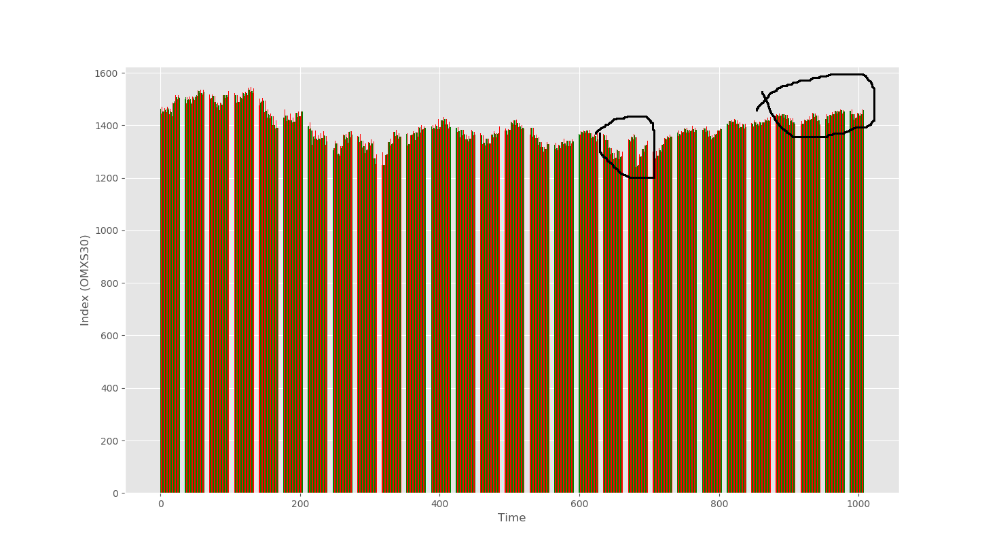
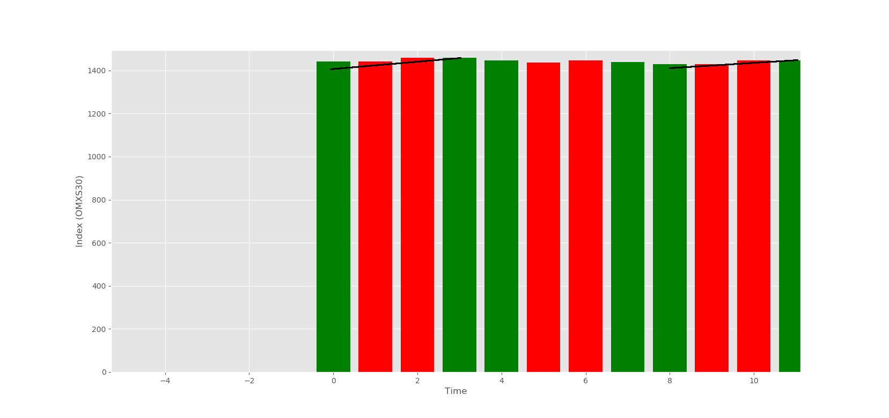

# Index "timetraveling" trader 
## Requirements
* Python 3.7.3
* matplotlib

### Main program
*python main.py data.json*

### Visualize
*python scripts/visualize.py data.json*

Only tested on linux ubuntu 16.04, but should be os agnostic

## Assumptions
* There is no casual ordering between high and low in one index entry, that is we can not assume we can buy *low_0* and sell *high_0* => resulting in *high_0 - low_0* profit. Here *_0* notes a specific time, where *_1 > _0* in time.
* No overnight fees or courtage
* Downtime, after hours movement, meaning *close_x* does not have to be *open_x+1*

## Goal
* Maximize profit for a given time series, where we can **ONLY** buy once and sell once

## Restrictions
* O(n) time finding MAX where n >> 0

## Intuition
Lets plot the index with the following points open, low, high, close in that order for each entry

We can alrady get a feeling of where we can make the most profit

Zooming in on a specific slice shows the following

Where the red bar, shows low and high. The lines show potential profit with buying and selling.

## Algorithm

Basically go through the graph from left to right and move forward while keeping track of the best score. Done once => O(n)

## Result
buy = 1240.680000 sell = 1468.160000
buy_date = 20160627 sell_date = 20161011
profit = 227.480000

buy_ix = 681 sell_ix = 986
corresponding to the marked regions in the first bar plot